从横须贺的港口，到伊豆的山海与修禅寺的溪流，再到东京的美术馆。这里收录十三张旅途中的照片。摄于2025年8月-9月。

## 横须贺海军基地

*两艘并泊的舰艇，桅杆高过港边屋舍。左为日本海自“足柄”，右为日本海自“摩耶”*

## 伊豆大室山

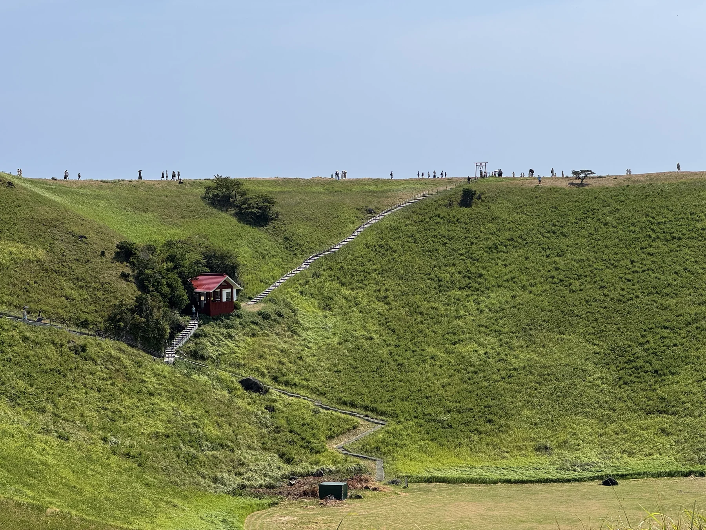

*步道沿火山口绕行，游人点缀在山脊上。*

## 城崎海岸

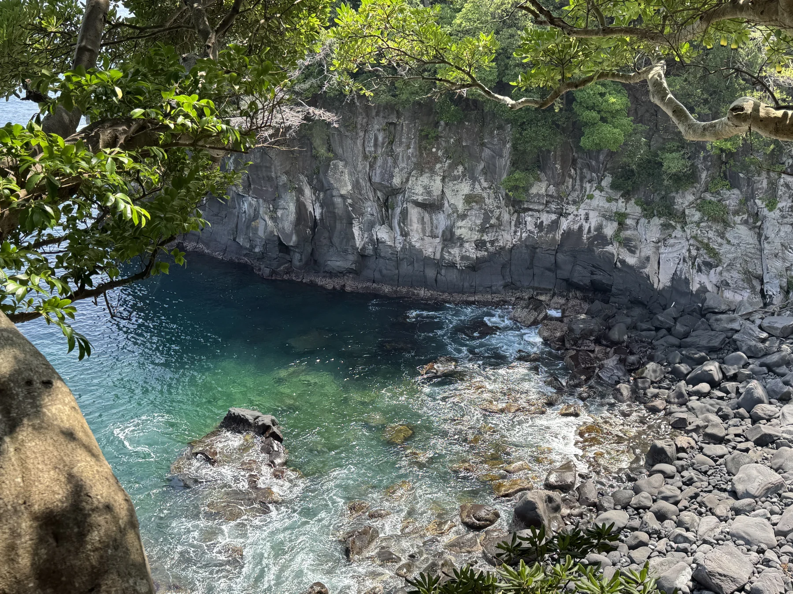

*岩壁围住一湾海水，浅处透出青碧。*

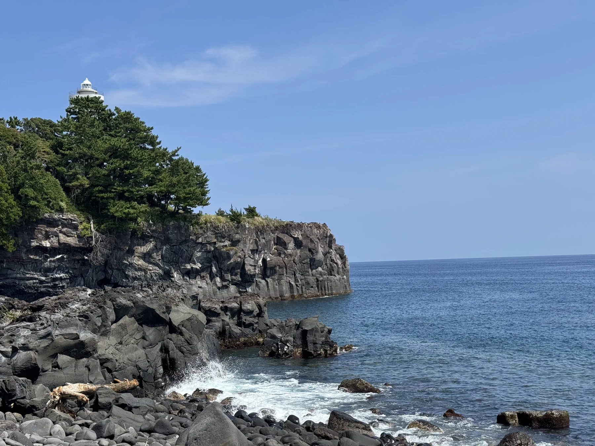

*灯塔立在海岬尽头，浪花在岩脚散开。*

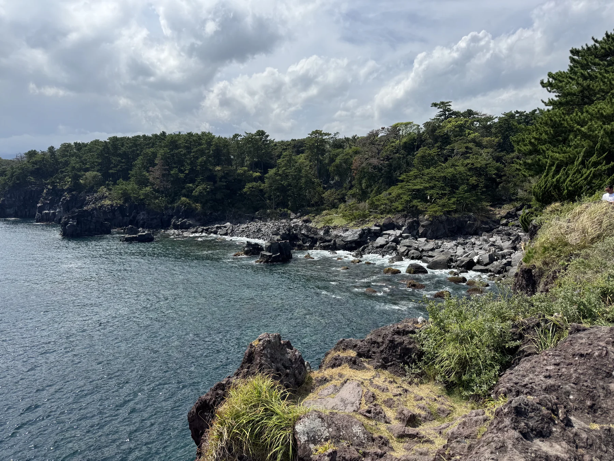

*云影压低了海色，岸边仍是一片绿。*

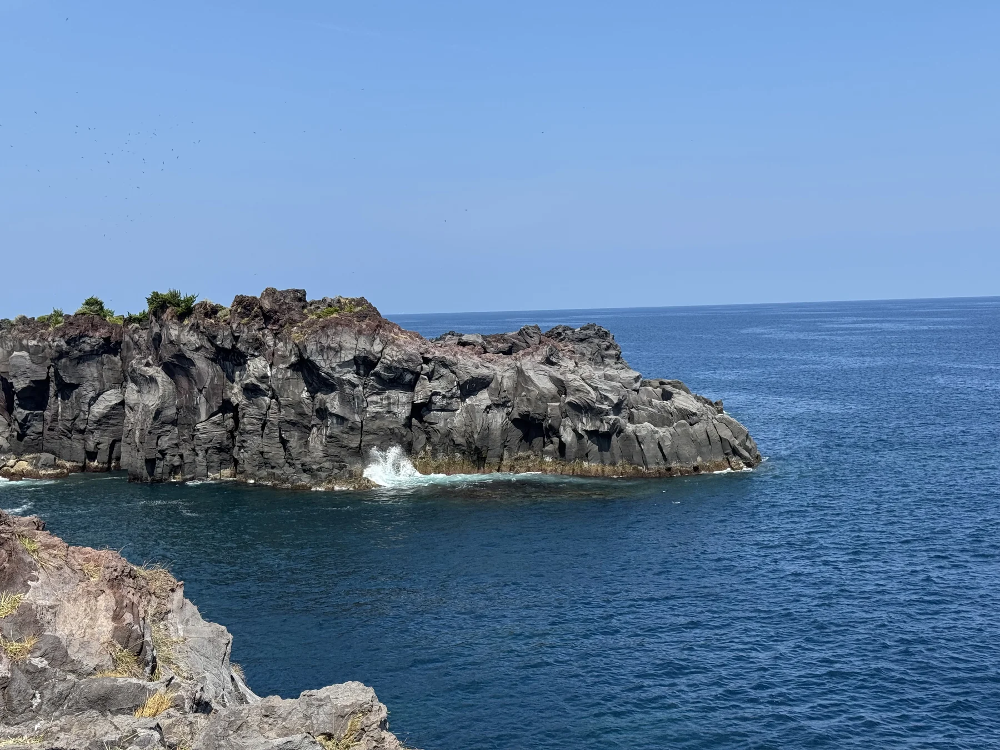

*礁岩伸向海面，浪花勾出它的边缘。*

## 伊豆高原站

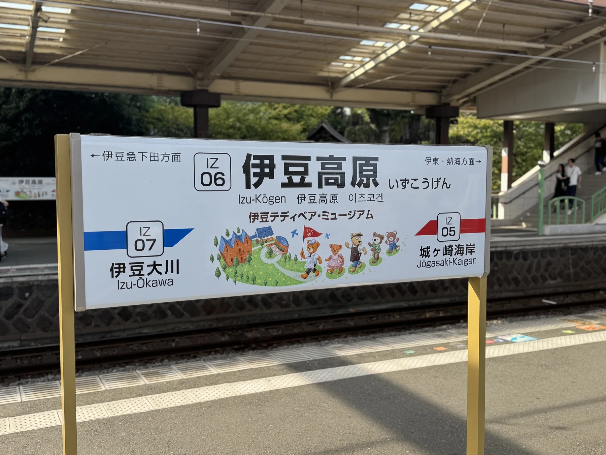

*伊豆高原站，山海之间的一站。*

## 伊豆修禅寺

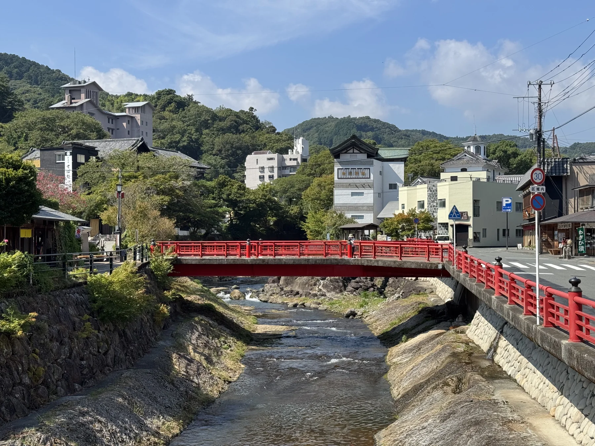

*红桥连接两岸，溪流穿过街巷。*

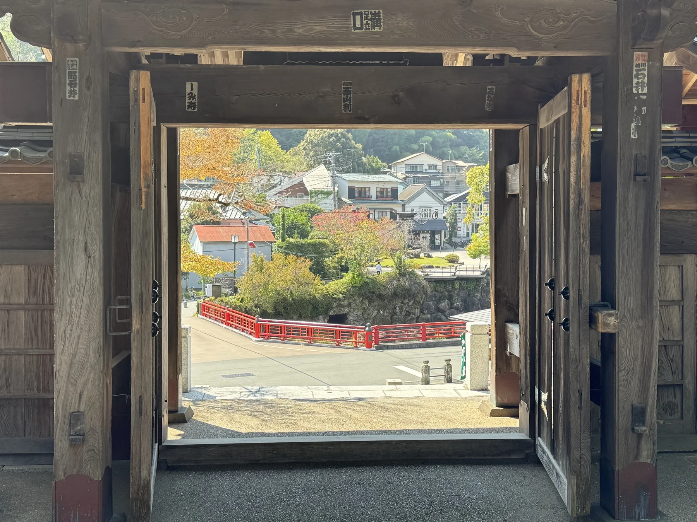

*从门内望出去，街景恰好落在框中。*

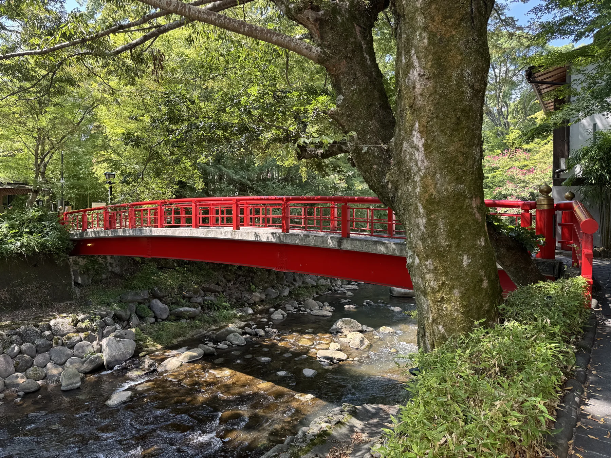

*红桥藏在绿荫里，溪水从树下流过。*

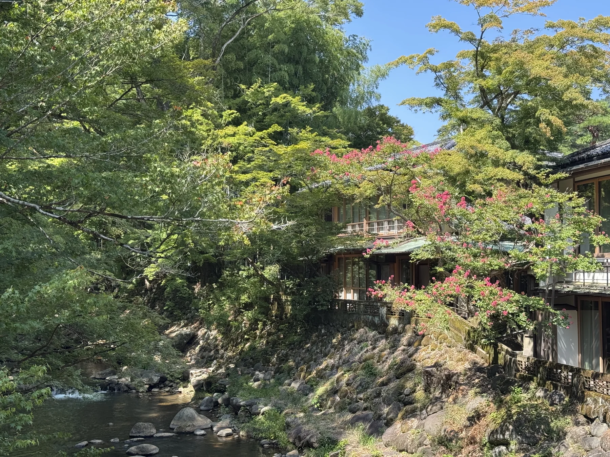

*花树沿溪而生，粉色落在满眼绿意之间。*

## 东京国立西洋美术馆

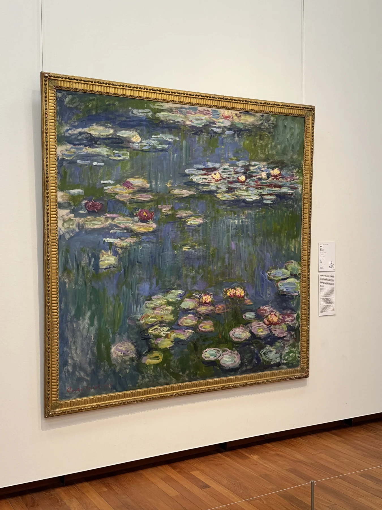

*莫奈《睡莲》，水面上的花与倒影。*

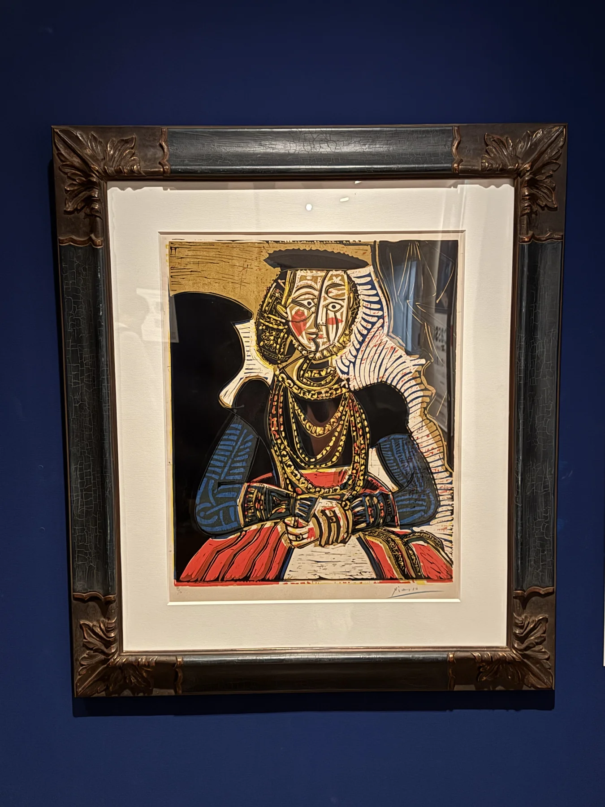

*毕加索的笔下，人物被重新组合。*

---

从港口的舰影，到伊豆的山海，再到美术馆里的花与人，旅途在不同的风景中慢慢展开。